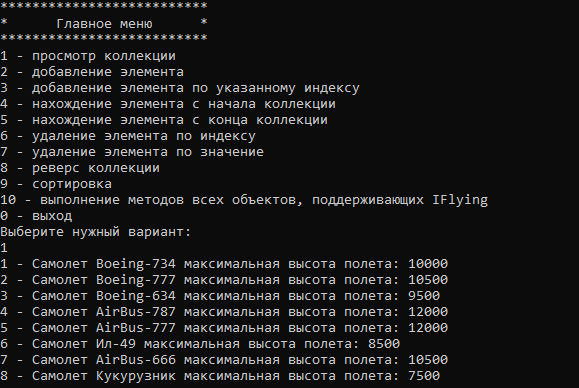
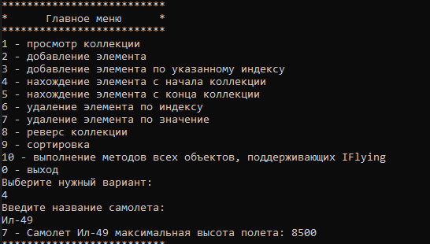
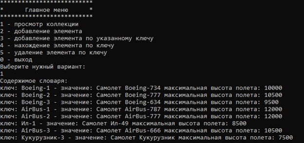
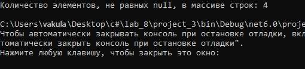
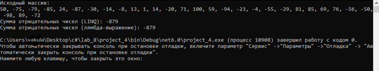

**ВЫПОЛНЕНИЯ ЗАДАНИЯ**

**Задание 1. Использование коллекции List.**

Используя List, создать коллекцию объектов Interface1 (из предыдущей работы).

Сразу проинициализировать ее значениями различных классов (в коде).

Спроектировать консольное меню со следующим функционалом:

1 – просмотр коллекции

2 – добавление элемента (данные вводим с клавиатуры)

3 – добавление элемента по указанному индексу (индекс и данные вводим с клавиатуры)

4 – нахождение элемента с начала коллекции (переопределить метод Equals или оператор == для вашего класса – сравнение только по полю name) (данные для поиска по полю name вводим с клавиатуры, вы должны иметь минимум 2 объекта в коллекции с одинаковыми именами)

5 – нахождение элемента с конца коллекции (данные для поиска по полю name вводим с клавиатуры, вы должны иметь минимум 2 объекта в коллекции с одинаковыми именами)

6 – удаление элемента по индексу (индекс вводим с клавиатуры)

7 – удаление элемента по значению (данные для поиска по полю name вводим с клавиатуры)

8 – реверс коллекции

9 – сортировка

10 – выполнение методов всех объектов, поддерживающих Interface2

0 – выход

Примечание.

Изначально заполните коллекцию некоторым количеством объектов. В дальнейшем для добавления, удаления и поиска элементов всю информацию запрашивать у пользователя.

Создаем интерфейсы IDriving и IFlying:

```csharp
using System;
using System.Collections.Generic;
using System.Linq;
using System.Text;
using System.Threading.Tasks;

namespace project_1
{
    interface IDriving
    {
        public void TimeOnRoad(double distance);
        public void Drive(float roadSpeed);
    }
}

using System;
using System.Collections.Generic;
using System.Linq;
using System.Text;
using System.Threading.Tasks;

namespace project_1
{
    interface IFlying
    {
        protected const double HIGH_ALTITUDE_SPEED_COEFFICIENT = 0.1;
        protected const double LOW_ALTITUDET_SPEED_COEFFICIENT = 0.15;

        public void TimeOnRoad(double distance);
        public void Fly(float airSpeed);
    }
}
```

После этого мы можем создать класс Car который будет наследовать методы у интерфейса IDriving:

```csharp
using System;
using System.Collections.Generic;
using System.Linq;
using System.Text;
using System.Threading.Tasks;
using System.Xml.Linq;

namespace project_1
{
    public class Car : IDriving
    {
        private string name;
        private string color;
        private float speed;

        public Car(string name, string color)
        {
            this.name = name;
            this.color = color;
        }

        public void Drive(float speed)
        {
            this.speed = speed;
            Console.WriteLine($"Машина {name} едет со скоростью: {speed} км/ч.");
        }

        public void TimeOnRoad(double distance)
        {
            double time = distance / speed;
            Console.WriteLine($"Машина {name} едет по дороге на расстояние {distance} км. Время в пути: {time:F2} ч.");
        }

        public override string ToString()
        {
            return $"Машина {name} c цветом {color}";
        }
    }
}
```

Далее создаем класс Plane который наследует у интерфейса IDriving и IFlying их методы:

```csharp
using System;
using System.Collections.Generic;
using System.Drawing;
using System.Linq;
using System.Runtime.CompilerServices;
using System.Text;
using System.Threading.Tasks;

namespace project_1
{
    public class Plane : IDriving, IFlying, IComparable<Plane>
    {
        public string name;
        public int altitude;
        public float roadSpeed;
        public float airSpeed;

        public Plane(string name)
        {
            this.name = name;
            this.altitude = 10000;
        }

        public Plane() : this("Noname")
        {
        }

        public Plane(string name, int altitude)
        {
            this.name = name;
            this.altitude = altitude;
        }

        public void Drive(float airSpeed)
        {
            this.roadSpeed = airSpeed;
            Console.WriteLine($"Самолет {name} едет по взлетной полосе со скоростью {airSpeed} км/ч");
        }

        public void Fly(float roadSpeed)
        {
            this.airSpeed = roadSpeed;
            Console.WriteLine($"Самолет {name} летит в полете со скоростью {roadSpeed} км/ч");
        }

        //склеивание
        public void TimeOnRoad(double distance)
        {
            //длина взлетной полосы 5км
            //время в пути при езде (при взлете и при приземление)
            double roadTime = 10 / roadSpeed;
            
            //время в полете
            double speedCoefficient = altitude >= 10000 ? IFlying.HIGH_AlTTITUDE_SPEED_COEFFICIENT : IFlying.LOW_ALTITUDET_SPEED_COEFFICIENT;
            double flightTime = (distance - 10) / (airSpeed - airSpeed * speedCoefficient);
            
            double time = roadTime + flightTime;
            Console.WriteLine($"Самолет {name} движется на расстояние {distance} км. Общее время в пути: {time:F2} ч.");
        }

        //кастинг
        void IDriving.TimeOnRoad(double distance)
        {
            //длина взлетной полосы 5км
            double roadTime = 60 * distance / roadSpeed;
            Console.WriteLine($"Самолет {name} едет по взлетной полосе {distance} км. Время в пути: {roadTime:F2} мин.");
        }

        //кастинг
        void IFlying.TimeOnRoad(double distance)
        {
            //время в полете
            double speedCoefficient = altitude >= 10000 ? IFlying.HIGH_AlTTITUDE_SPEED_COEFFICIENT : IFlying.LOW_ALTITUDET_SPEED_COEFFICIENT;
            double flightTime = distance / (airSpeed - airSpeed * speedCoefficient);
            Console.WriteLine($"Самолет {name} летит на расстояние {distance} км. Время в полете: {flightTime:F2} ч.");
        }

        public void PlaneDrivingTimeOnRoad(double distance)
        {
            ((IDriving)this).TimeOnRoad(distance);
        }

        public void PlaneFlyingTimeOnRoad(double distance)
        {
            ((IFlying)this).TimeOnRoad(distance);
        }

        public override string ToString()
        {
            return $"Самолет {name} максимальная высота полета: {altitude}";
        }

        public override bool Equals(object? obj)
        {
            return ((obj as Plane)?.name??"")==this.name;
        }

        public int CompareTo(Plane? other)
        {
            return altitude.CompareTo(other?.altitude ?? 0);
        }
    }
}
```

Теперь созданные классы можно реализовать в Programm.cs и решить все пункты задачи создав меню:

```csharp
using project_1;

List<Plane> list = new List<Plane>
{
    new Plane("Boeing-734", 10000 ),
    new Plane("Boeing-777", 10500 ),
    new Plane("Boeing-634", 9500 ),
    new Plane("AirBus-787", 12000 ),
    new Plane("AirBus-777", 12000 ),
    new Plane("Ил-49", 8500 ),
    new Plane("AirBus-666", 10500 ),
    new Plane("Кукурузник", 7500 ),
};

while (true)
{
    Console.WriteLine("*************");
    Console.WriteLine("*    Главное меню    *");
    Console.WriteLine("*************");
    Console.WriteLine("1 – просмотр коллекции");
    Console.WriteLine("2 – добавление элемента ");
    Console.WriteLine("3 – добавление элемента по указанному индексу ");
    Console.WriteLine("4 - нахождение элемента с начала коллекции");
    Console.WriteLine("5 - нахождение элемента с конца коллекции");
    Console.WriteLine("6 - удаление элемента по индексу");
    Console.WriteLine("7 - удаление элемента по значению");
    Console.WriteLine("8 - реверс коллекции");
    Console.WriteLine("9 - сортировка");
    Console.WriteLine("10 – выполнение методов всех объектов, поддерживающих IFlying");
    Console.WriteLine("0 – выход");
    Console.WriteLine("Выберите нужный вариант:");
    
    int choose;
    if (Int32.TryParse(Console.ReadLine(), out choose) == false)
    {
        Console.WriteLine("Введено неверное значение, пожалуйста, повторите попытку!");
        continue;
    }
    
    switch (choose)
    {
        case 1: method1(list); break;
        case 2: method2(list); break;
        case 3: method3(list); break;
        case 4: method4(list); break;
        case 5: method5(list); break;
        case 6: method6(list); break;
        case 7: method7(list); break;
        case 8: method8(list); break;
        case 9: method9(list); break;
        case 10: method10(list); break;
        default: return;
    }
}

void method1(List<Plane> list)
{
    int i = 1;
    foreach (Plane plane in list)
    {
        Console.WriteLine($"{i++} - {plane}");
    }
    Console.WriteLine();
    Console.ReadKey();
}

void method2(List<Plane> list)
{
    Console.WriteLine("Введите название самолета:");
    string planeName = Console.ReadLine();
    
    Console.WriteLine("Введите максимально возможную высоту полета самолета:");
    int planeAltitude;
    
    if (Int32.TryParse(Console.ReadLine(), out planeAltitude) == false || planeAltitude < 7000 || planeAltitude > 12500)
    {
        Console.WriteLine("Введено неверное значение, пожалуйста, повторите попытку!");
        return;
    }
    
    list.Add(new Plane(planeName, planeAltitude));
    Console.WriteLine("Элемент успешно добавлен в коллекцию");
}

void method3(List<Plane> list)
{
    Console.WriteLine("Введите индекс:");
    int index;
    
    if (Int32.TryParse(Console.ReadLine(), out index) == false || index < 0 || index > list.Count)
    {
        Console.WriteLine("Введено неверное значение, пожалуйста, повторите попытку!");
        return;
    }
    
    Console.WriteLine("Введите название самолета:");
    string planeName = Console.ReadLine();
    
    Console.WriteLine("Введите максимально возможную высоту полета самолета:");
    int planeAltitude;
    
    if (Int32.TryParse(Console.ReadLine(), out planeAltitude) == false || planeAltitude < 7000 || planeAltitude > 12500)
    {
        Console.WriteLine("Введено неверное значение, пожалуйста, повторите попытку!");
        return;
    }
    
    list.Insert(index - 1, new Plane(planeName, planeAltitude));
    Console.WriteLine("Элемент успешно добавлен в коллекцию");
}

void method4(List<Plane> list)
{
    Console.WriteLine("Введите название самолета: ");
    string name = Console.ReadLine();
    
    Plane plane = new Plane(name);
    int index =

 list.IndexOf(plane);
    
    if (index < -1)
    {
        Console.WriteLine("Элемент не найден");
    }
    else
    {
        Console.WriteLine($"{index + 1} - {list[index]}");
    }
}

void method5(List<Plane> list)
{
    Console.WriteLine("Введите название самолета: ");
    string name = Console.ReadLine();
    
    // Используем LastOrDefault для поиска последнего элемента с заданным именем
    Plane lastPlane = list.LastOrDefault(p => p.Equals(new Plane(name)));
    
    if (lastPlane == null)
    {
        Console.WriteLine("Элемент не найден");
    }
    else
    {
        Console.WriteLine($"{list.LastIndexOf(lastPlane) + 1} - {lastPlane}");
    }
}

void method6(List<Plane> list)
{
    Console.WriteLine("Введите индекс элемента для удаления:");
    int index;
    
    if (Int32.TryParse(Console.ReadLine(), out index) == false || index - 1 < 0 || index - 1 >= list.Count)
    {
        Console.WriteLine("Введено неверное значение, пожалуйста, повторите попытку!");
        return;
    }
    
    list.RemoveAt(index - 1);
    Console.WriteLine("Элемент успешно удален из коллекции");
}

void method7(List<Plane> list)
{
    Console.WriteLine("Введите название самолета для удаления:");
    string planeName = Console.ReadLine();
    
    Plane planeToRemove = list.FirstOrDefault(p => p.Equals(new Plane(planeName)));
    
    if (planeToRemove == null)
    {
        Console.WriteLine("Элемент не найден");
    }
    else
    {
        list.Remove(planeToRemove);
        Console.WriteLine("Элемент успешно удален из коллекции");
    }
}

void method8(List<Plane> list)
{
    list.Reverse();
    Console.WriteLine("Коллекция успешно перевернута");
}

void method9(List<Plane> list)
{
    list.Sort();
    Console.WriteLine("Коллекция успешно отсортирована");
}

void method10(List<Plane> list)
{
    foreach (var plane in list)
    {
        // Выполнение методов всех объектов, поддерживающих IDriving
        if (plane is IDriving)
            ((IDriving)plane).Drive(100); // Пример вызова метода IDriving
        Console.WriteLine();
    }
}
```

Результаты:







**Задание 2. Использование параметризованной коллекции**

Используя параметризованную коллекцию, продемонстрировать ее возможности по аналогии с п.1.Interface1, вызвать метод из этого интерфейса.

\5) Dictionary (добавить работу с ключами)

Решение:

Используем ранее созданные классы  (оставляем ссылку на прошлый проект) для решения нашей задачи в Program2.cs:

```csharp
using project_1;
using System;
using System.Collections.Generic;

Dictionary<string, Plane> planeDictionary = new Dictionary<string, Plane>();

// Пример заполнения словаря
planeDictionary.Add("Boeing-1", new Plane("Boeing-734", 10000));
planeDictionary.Add("Boeing-2", new Plane("Boeing-777", 10500));
planeDictionary.Add("Boeing-3", new Plane("Boeing-634", 9500));
planeDictionary.Add("AirBus-1", new Plane("AirBus-787", 12000));
planeDictionary.Add("AirBus-2", new Plane("AirBus-777", 12000));
planeDictionary.Add("Ил-1", new Plane("Ил-49", 8500));
planeDictionary.Add("AirBus-3", new Plane("AirBus-666", 10500));
planeDictionary.Add("Кукурузник-3", new Plane("Кукурузник", 7500));

while (true)
{
    Console.WriteLine("*************");
    Console.WriteLine("*    Главное меню    *");
    Console.WriteLine("*************");
    Console.WriteLine("1 – просмотр словаря");
    Console.WriteLine("2 – добавление элемента ");
    Console.WriteLine("3 – добавление элемента по указанному ключу ");
    Console.WriteLine("4 - нахождение элемента по ключу");
    Console.WriteLine("5 - удаление элемента по ключу");
    Console.WriteLine("0 – выход");
    Console.WriteLine("Выберите нужный вариант:");

    int choose;
    if (!Int32.TryParse(Console.ReadLine(), out choose))
    {
        Console.WriteLine("Введено неверное значение, пожалуйста, повторите попытку!");
        continue;
    }

    switch (choose)
    {
        case 1: method1(planeDictionary); break;
        case 2: method2(planeDictionary); break;
        case 3: method3(planeDictionary); break;
        case 4: method4(planeDictionary); break;
        case 5: method5(planeDictionary); break;
        default: return;
    }
}

void method1(Dictionary<string, Plane> dictionary)
{
    Console.WriteLine("Содержимое словаря:");
    foreach (var kvp in dictionary)
    {
        Console.WriteLine($"ключ: {kvp.Key} - значение: {kvp.Value}");
    }
    Console.WriteLine();
    Console.ReadKey();
}

void method2(Dictionary<string, Plane> dictionary)
{
    Console.WriteLine("Введите название самолета:");
    string planeName = Console.ReadLine();

    Console.WriteLine("Введите максимально возможную высоту полета самолета:");
    int planeAltitude;

    if (!Int32.TryParse(Console.ReadLine(), out planeAltitude) || planeAltitude < 7000 || planeAltitude > 12500)
    {
        Console.WriteLine("Введено неверное значение, пожалуйста, повторите попытку!");
        return;
    }

    // Генерируем уникальный ключ типа string
    string uniqueKey = Guid.NewGuid().ToString();

    // Добавляем элемент в словарь по имени в качестве ключа
    dictionary.Add(uniqueKey, new Plane(planeName, planeAltitude));
    Console.WriteLine("Элемент успешно добавлен в словарь");
}

void method3(Dictionary<string, Plane> dictionary)
{
    Console.WriteLine("Введите ключ: ");
    string key = Console.ReadLine();

    if (dictionary.ContainsKey(key))
    {
        Console.WriteLine("Элемент с таким ключом уже существует");
        return;
    }

    Console.WriteLine("Введите название самолета:");
    string planeName = Console.ReadLine();

    Console.WriteLine("Введите максимально возможную высоту полета самолета:");
    int planeAltitude;

    if (!Int32.TryParse(Console.ReadLine(), out planeAltitude) || planeAltitude < 7000 || planeAltitude > 12500)
    {
        Console.WriteLine("Введено неверное значение, пожалуйста, повторите попытку!");
        return;
    }

    // Добавляем элемент в словарь по введенному ключу
    dictionary.Add(key, new Plane(planeName, planeAltitude));
    Console.WriteLine("Элемент успешно добавлен в словарь");
}

void method4(Dictionary<string, Plane> dictionary)
{
    Console.WriteLine("Введите ключ: ");
    string key = Console.ReadLine();

    if (dictionary.TryGetValue(key, out var plane))
    {
        Console.WriteLine($"{key} - {plane}");
    }
    else
    {
        Console.WriteLine("Элемент с таким ключом не найден");
    }
}

void method5(Dictionary<string, Plane> dictionary)
{
    Console.WriteLine("Введите ключ для удаления:");
    string key = Console.ReadLine();

    if (dictionary.ContainsKey(key))
    {
        // Удаляем элемент из словаря по ключу
        dictionary.Remove(key);
        Console.WriteLine("Элемент успешно удален из словаря");
    }
    else
    {
        Console.WriteLine("Элемент с таким ключом не найден");
    }
}
```





**Задание 3. Обобщенный метод**

Создайте обобщенный метод, который получает массив произвольного типа и возвращает количество элементов, не равных null.

Используем ранее созданные классы (оставляем ссылку на прошлый проект) для решения нашей задачи в Program3.cs:

```csharp
using project_1;

Plane[] planes = new Plane[]
{
    null,
    new Plane("Boeing-734", 10000),
    new Plane("Boeing-777", 10500),
    new Plane("Boeing-634", 9500),
    null,
    null,
    new Plane("AirBus-787", 12000),
};

Console.WriteLine($"Количество элементов, не равных null, в массиве строк: {CountNonNullElements(planes)}");

int CountNonNullElements<T>(T[] array)
{
    int count = 0;

    foreach (T element in array)
    {
        if (element != null)
        {
            count++;
        }
    }

    return count;
}
```

Результат выполнения:



**Задание 4. LINQ с массивом**

Создайте массив из 30 элементов типа int. Заполните его случайными числами. Выберите диапазон случайных чисел, оптимальный для решаемой задачи. Выполните задание, используя сначала запрос LINQ, а затем метод расширения (лямбда-выражение).

\7) Вычислить сумму всех отрицательных чисел\.

Затем созданный класс можно использовать в Program.cs4:

```csharp
using System;

class Program
{
    static void Main()
    {
        // Создаем массив из 30 случайных чисел в диапазоне от -100 до 100
        int[] numbers = GenerateRandomArray(30, -100, 100);

        // Используем запрос LINQ для вычисления суммы отрицательных чисел
        int sumWithLINQ = (from number in numbers where (number < 0) select number).Sum();

        // Используем метод расширения и лямбда-выражение для вычисления суммы отрицательных чисел
        int sumWithLambda = numbers.Where(n => n < 0).Sum();

        Console.WriteLine("Исходный массив:");
        Console.WriteLine(string.Join(", ", numbers));
        Console.WriteLine($"Сумма отрицательных чисел (LINQ): {sumWithLINQ}");
        Console.WriteLine($"Сумма отрицательных чисел (лямбда-выражение): {sumWithLambda}");
    }

    static int[] GenerateRandomArray(int length, int minValue, int maxValue)
    {
        int[] array = new int[length];
        Random random = new Random();

        for (int i = 0; i < length; i++)
        {
            array[i] = random.Next(minValue, maxValue + 1);
        }

        return array;
    }
}
```

Результат выполнения:



**Задание 5. LINQ с коллекцией**

Создайте коллекцию объектов класса Person. Используемые поля – имя, год рождения, должность, оклад, компания (Company). Класс Company содержит название компании и год основания. Получите новую коллекцию, согласно варианту.

\7) Список должностей с суммарным окладом, который получают все сотрудники на этой должности в этой компании\. Содержит компанию, должность, сумму\.

Создадим классы Person и Company:

```csharp
using System;
using System.Collections.Generic;
using System.Linq;
using System.Text;
using System.Threading.Tasks;

namespace project_5
{
    class Person
    {
        public string name;
        public int yearOfBirth;
        public float salary;
        public Company company;
        public string position;
    }
}

namespace project_5
{
    class Company
    {
        public string name;
        public int yearOfFoundation;
    }
}
```

Далее с использованием данных классов реализуем решение поставленной задачи в Program5.cs:

```csharp
using project_5;

Company samsung = new Company { name = "Samsung", yearOfFoundation = 1969 };
Company apple = new Company { name = "Apple", yearOfFoundation = 1998 };
Company spaceX = new Company { name = "SpaceX", yearOfFoundation = 2002 };
Company tesla = new Company { name = "Tesla", yearOfFoundation = 2003 };

List<Company> companies = new List<Company>()
{
    samsung,
    apple,
    spaceX,
    tesla
};

List<Person> persons = new List<Person>()
{
    new Person
    {
        name = "Ivan",
        yearOfBirth = 1977,
        salary = 7000,
        company = samsung,
        position = "data scientist"
    },

    new Person
    {
        name = "Su Yang",
        yearOfBirth = 1977,
        salary = 1000,
        company = samsung,
        position = "data scientist"
    },

    new Person
    {
        name = "Naruto",
        yearOfBirth = 1977,
        salary = 8500,
        company = samsung,
        position = "data scientist"
    },

    new Person
    {
        name = "David",
        yearOfBirth = 1999,
        salary = 4500,
        company = new Company { name = "Samsung", yearOfFoundation = 1969 },
        position = "data scientist"
    },

    new Person
    {
        name = "Stepan",
        yearOfBirth = 1998,
        salary = 7500,
        company = tesla,
        position = "practice engineer"
    },

    new Person
    {
        name = "Ahmed",
        yearOfBirth = 1987,
        salary = 9000,
        company = spaceX,
        position = "data scientist"
    },
};

var result = from person in persons
             group person by new { person.company, person.position } into grouped
             select new
             {
                 Company = grouped.Key.company,
                 Position = grouped.Key.position,
                 TotalSalary = grouped.Sum(person => person.salary)
             };

Console.WriteLine("Список должностей с суммарным окладом:");

foreach (var item in result)
{
    Console.WriteLine($"Компания: {item.Company.name}, Должность: {item.Position}, Суммарный оклад: {item.TotalSalary}");
}
```

Результат выполнения:


